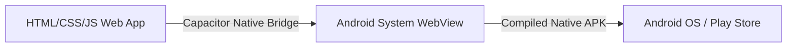
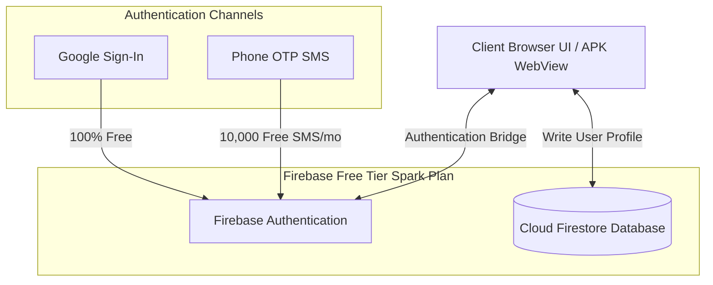

# 🚖 IshanCabs: Project Analysis & Modular Feature Plan (with APK Compatibility)

This document provides a detailed analysis of your existing repository files, evaluates the design choices, and presents a modular, highly scalable folder architecture for the completed **Customer Auth (Sign Up & Login) Module** and future enhancements (e.g., Bookings). It addresses hosting on **GitHub Pages** for a Proof of Concept (PoC) and wrapping into an **Android APK (Play Store)**, leveraging a 100% **Free-Tier/Cost-Effective** infrastructure tailored for India (INR).

---

## 1. Summary of Project Setup & Design Review

### 📂 Repository Analysis
Your workspace consists of a highly efficient, lightweight web application:
- **`index.html`**: A semantically rich landing page utilizing **Tailwind CSS via CDN** for rapid styling, coupled with custom responsive layouts. Features a premium navigation header overlay with a dynamic auth state button.
- **`styles.css`**: A comprehensive custom stylesheet containing custom CSS variables, custom tokens, custom media queries, and sophisticated keyframe animations (e.g., `.pulse-button` for CTA, `.card-route` styling). It has robust accessibility adjustments (such as `prefers-reduced-motion` safety) and printing provisions.
- **`app.js`**: Re-engineered as a native ES module that coordinates landing page interactions and acts as an active **Authentication State Observer**.
- **Backend Setup**: Powered by **Firebase Spark (Free Tier)**. Authentication (Google Login & Phone OTP) and user profile storage (Cloud Firestore) are fully integrated via client-side libraries.

### 🎨 Design & UI Review
- **Aesthetic Quality**: The visual design is modern, engaging, and premium. It relies on a playful dark slate base (`#0F172A`/`#1E293B`) accented by warm honey-yellow/amber details (`#F59E0B`), giving it a sleek "urban premium cab" identity.
- **Responsiveness**: Excellent. Grids dynamically scale down from 4 columns on desktop to stack nicely on mobile screens.
- **Micro-Animations**: Custom hover animations and persistent pulse states on critical booking buttons keep the page interactive and energetic.

---

## 2. Multi-Page vs. Single-Page Architecture for PoC

Since you are hosting the Proof of Concept (PoC) on **GitHub Pages** and wrapping it into an **Android APK** later, we have to design with key constraints in mind:
- **GitHub Pages is a static file host**: It does not support Node.js, Python, or Java runtimes, meaning all compilation must happen client-side or during a build step.
- **The Routing Challenge**: Standard Single-Page Application (SPA) routers (e.g., React Router, Vue Router) using HTML5 `history.pushState` fail on page reload on GitHub Pages (yielding `404 Not Found` because GitHub has no real backend to redirect arbitrary routes to `index.html`).
- **Android WebView Compatibility**: When wrapped inside an APK, files are loaded locally (e.g., from `capacitor://localhost` or `file:///`). Deep nesting or dynamic route-rewriting can break asset lookups on mobile.

### 🏆 Recommended Solution: Modular Multi-Page Application (MPA)
By organizing modules into logical subfolders with their own static files (e.g., `/auth/auth.html`), **GitHub Pages serves them natively and flawlessly**. You will avoid any router hack workarounds and keep the codebase simple, transparent, and extremely lightweight.

Using **Vanilla JavaScript with ES Modules (`type="module"`)** allows us to:
1. Write clean, modular, and reusable JavaScript classes/functions.
2. Avoid heavy bundlers like Webpack or Vite for the PoC stage, making local development as simple as launching a basic live server.
3. Keep the file structure highly isolated. When you want to add the `booking` module, it will reside in its own folder completely independent of `auth`.
4. Ensure 100% compatibility with mobile wrapper engines, which serve static HTML directory structures out of the box.

---

## 3. Mobile APK Wrapper Architecture (Capacitor)

To turn this codebase into a premium Android APK for the Google Play Store, we will use **Capacitor** (created by Ionic). It is the modern, high-performance successor to Cordova.



### 💡 Why Capacitor is Ideal for Your Tech Stack:
1. **Zero Framework Overhead**: It wraps vanilla HTML/CSS/JS directly. It doesn't force you to rewrite your app in React Native or Flutter.
2. **Build-Once, Deploy-Twice**: Your exact folder structure will run in the browser (GitHub Pages) and inside the native APK without duplicative development.
3. **Access Native Features**: When ready, you can easily add plugins to trigger native features (like Android Geolocation, Push Notifications, or Secure Storage).

### ⚠️ Critical Constraints for APK Compatibility:
1. **Strict Relative Paths**: You MUST use relative paths (e.g., `./modules/auth/auth.html` or `../shared/utils.js`) instead of root-absolute paths (`/modules/auth/auth.html`). WebView asset loaders look up files relative to the current virtual directory.
2. **Firebase Native vs. Web Auth**: Standard web-redirect authentication (`signInWithRedirect` or `signInWithPopup`) **fails** in mobile WebViews because the app runs inside a secure sandboxed origin. 
   * *The Strategy*: We will isolate the authentication layer inside a modular adapter. For web (GitHub Pages), it will use standard Firebase Web Auth. For mobile (APK), we can seamlessly swap to the `@capacitor-firebase/authentication` plugin which binds native Google Sign-In to your Firebase project.

---

## 4. Completed Modular Folder Structure

Here is the completed modular folder structure implemented to scale your application seamlessly and accommodate native Android assets:

```text
cab-website/
├── index.html                 # Main Landing Page (SethCabs/IshanCabs)
├── styles.css                 # Global Custom Styles & Design System Tokens
├── app.js                     # Global Observer Module (Dynamic Header & Login/Logout toggle)
│
├── assets/                    # Shared static assets
│   ├── images/                # Cab and driver photography
│   └── icons/                 # Brand and route SVGs
│
├── modules/                   # Isolated feature modules
    │
    ├── auth/                  # Customer Authentication Module
    │   ├── auth.html          # Unified Sign Up & Login Page (Google/Phone tabs + Close button)
    │   ├── auth.css           # Authentication UI styles (Google buttons, OTP inputs)
    │   ├── authUI.js          # Handles interactive elements (tabs, forms, alerts)
    │   └── authService.js     # Communicates with Firebase Auth (supports Web & Native APK bridging)
    │
    ├── booking/               # Future Booking Module (Scalable plug-and-play)
    │   ├── booking.html       # Booking flow screen
    │   ├── booking.css        # Booking specific layout
    │   ├── bookingUI.js       # Handles booking inputs & fare calculations
    │   └── bookingService.js  # Connects to Firebase Firestore for booking CRUD
    │
    └── shared/                # Universal Shared Modules & Integrations
        ├── firebase.js        # Core Firebase Config & SDK Initialization (Firestore/Auth)
        ├── dbService.js       # Common Firestore operations (user profiles, audit columns)
        └── utils.js           # Utility helpers (time formatting, input sanitization)
```

---

## 5. Completed Auth Module Enhancements

### A. Dynamic Login / Logout Header button (`app.js`)
Rather than keeping a static hardcoded button on the landing page, `app.js` is loaded as an ES Module and acts as a dynamic state coordinator:
- **State Check**: Listens to Firebase’s `onAuthStateChanged`.
- **Logged-Out State**: Renders **"Rider Login / Sign Up"** with the default amber user profile icon. Clicking navigates normally to `./modules/auth/auth.html`.
- **Logged-In State**: Renders **"Logout"** with a rose-red sign-out icon. Hovering transitions the border to a warning color (`hover:border-rose-500`). 
- **Logout intercept**: Intercepts the click, prompts a confirmation dialog (`"Are you sure you want to log out?"`), signs the user out cleanly, and updates the UI instantly without needing a full page refresh.

### B. Interactive Close Button (`auth.html`)
To prevent riders from getting stuck on the login screen, we implemented a standard exit route:
- **Design**: An absolute positioned cross button (`x`) inside the main glassmorphic login card.
- **Styling**: Blends with the playful-modern glassmorphic theme. It transitions smoothly to white on hover with a semi-transparent dark backdrop (`hover:bg-slate-800/60 hover:text-white`).
- **Touch-Optimized**: Scales down slightly (`active:scale-95`) when pressed.
- **WebView-Safe**: Employs a strict relative route (`../../index.html`) to guarantee path resolution inside Capacitor.

---

## 6. Cost-Effective Integration Architecture (Free Tier & INR Target)

To respect your goal of staying within the **Free Tier** or at a modest cost, we structured the entire backend using **Firebase Spark (Free Tier)**.



### 💳 Service Cost Matrix (INR)

| Service | Tier / Plan | Limits & Pricing | Suitability for PoC / MVP / APK |
| :--- | :--- | :--- | :--- |
| **Hosting (Web)** | GitHub Pages | **100% Free** forever. | Perfect for PoC and early staging. |
| **Wrapping (APK)** | Capacitor | **100% Free** & Open Source. | Excellent, premium solution for Play Store deployment. |
| **Authentication** | Firebase Auth (Google) | **100% Free** & unlimited. | Zero friction for user growth on web & APK. |
| **Authentication** | Firebase Auth (Phone OTP) | **10,000 free verifications / month**. | Highly generous. Plenty for validation. |
| **Database** | Cloud Firestore | **1 GB Storage** free.<br>• 50,000 Reads/day (Free)<br>• 20,000 Writes/day (Free)<br>• 20,000 Deletes/day (Free) | Highly performant. Free tier supports hundreds of active daily users. |
| **Domain Name** | Custom Domain | **₹300 - ₹800 / year** (average for `.in` or `.com` on Cloudflare/Hostinger). | Optional. Works out of the box with GitHub Pages via custom CNAME. |

---

## 7. Firebase Customer Profiles & Audit Columns

When a customer registers, their profile is initialized inside a Firestore collection named `users` keyed by their Firebase Auth unique ID (`uid`). This guarantees security rules can easily isolate user access.

### 🗄️ Firestore User Data Model

```json
{
  "uid": "google_or_phone_unique_firebase_uid",
  "name": "Ishan Mukherjee",
  "city": "Kolkata",
  "phone": "+918981538038",
  "email": "ishan@example.com", // Nullable if signing up via Phone OTP
  "auth_provider": "google.com", // "google.com" or "phone"
  "status": "active", // "active", "suspended", "pending"
  "creation_ts": "server_timestamp", // Audit Column
  "updated_ts": "server_timestamp" // Audit Column
}
```

### 🛡️ Why Use Server Timestamps?
Using client-side Javascript `new Date()` is unreliable and insecure, as users can tamper with their system clocks. We will use:
- **`firebase.firestore.FieldValue.serverTimestamp()`** during writes, which ensures that Firestore logs the exact timezone-accurate time on the server side.

---

## 8. Implementation Action Plan

1. **Step 1: Firebase Project Setup**
   - Initialize a Firebase account, create a new project, and configure authentication (enable Google Login and Phone Auth).
   - Configure Firestore Database in Test Mode.
2. **Step 2: Create Modular Folders**
   - Create directories under `modules/` (`auth`, `shared`).
   - Setup `modules/shared/firebase.js` to establish connection.
   - **Crucial Rule**: Build using strictly **relative file linking** to guarantee out-of-the-box WebView compile readiness.
3. **Step 3: Build the SignUp/Login UI**
   - Develop `auth.html` & `auth.css` mirroring the playful modern theme, utilizing glassmorphism and subtle transitions.
   - Implement dynamic view transitions (sliding between Google Sign-In and Phone OTP fields).
4. **Step 4: Integrate Firebase Client Operations & Bridge Layer**
   - Implement native platform detection:
     ```javascript
     const isNative = window.Capacitor !== undefined;
     ```
   - Connect the login screen triggers to the Google/OTP authentication handlers using a decoupled service layer.
   - Insert database writing commands to populate user information upon successful signup.
5. **Step 5: Verify, Deploy, & Prepare APK**
   - Perform local verification of the signup loop.
   - Deploy web version to GitHub Pages.
   - Wrap the project using Capacitor CLI (`npx cap init` and `npx cap add android`) to establish the Android build pipeline.
